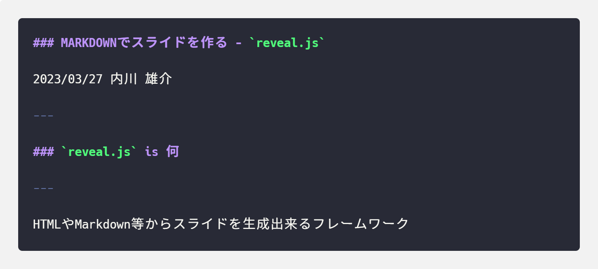
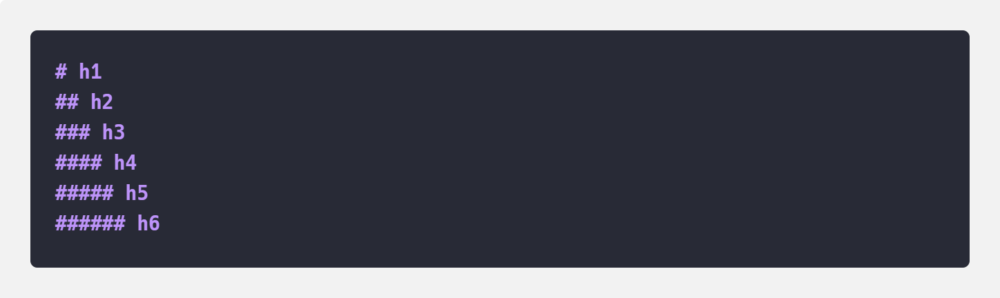
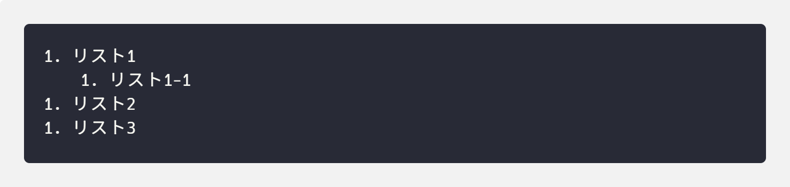
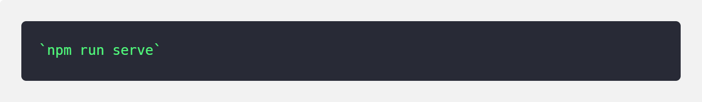
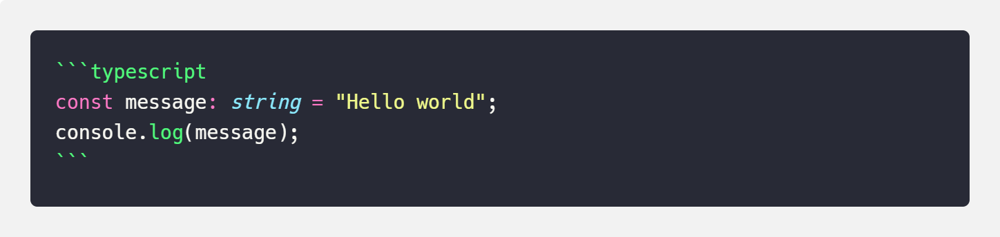
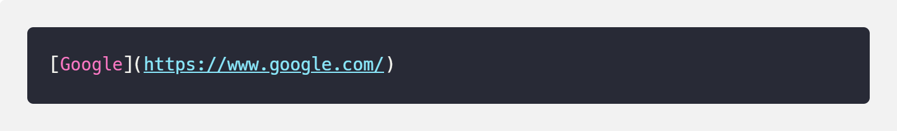

### MARKDOWNでスライドを作る - `reveal.js`

2023/03/27 内川 雄介

---

### `reveal.js` is 何

---

HTMLやMarkdown等からスライドを生成出来るフレームワーク

---

このスライドも **`reveal.js`** で作っています

---

### 誰が嬉しいのか

---

ソースコードからグラフィカルなものを作るのが好きな人  
( `PlantUML` とか `Mermaid` とかいいよね)

---

### 試してみたい方

↓↓↓スターター用のリポジトリを作りました↓↓↓

<a href="https://github.com/ERK-Uchikawa/reveal-js-markdown-starter" target="_blank">ERK-Uchikawa/reveal-js-markdown-starter: The HTML Presentation Framework</a>

---

1. Node.js をインストール
1. `npm i` を実行して、パッケージをインストール
1. `npm run serve` を実行 (サーバー起動)
1. `localhost:8000` にアクセス
1. `index.md` を編集して保存
1. ホットリロードがかかる

---

### 書き方

- Markdownの書式と、HTMLタグが使える
- 一部 `reveal.js` 独自の仕様あり

---

### 代表的な書式の紹介

5分だと解説キツイので流しで

---

### ページ区切り: `---`

`---` で区切るとページが分かれる  
(Markdownだと水平線になるやつ)



---

### 見出し: `#` ~ `######`

`#` を先頭に付けると見出し



---

### 番号なしリスト: `-`

`-` を先頭に付けると番号なしリスト


- リスト1
    - リスト1-1
- リスト2
- リスト3

<br />

---

### 番号つきリスト: `1.`

`1.` を先頭に付けると番号つきリスト



1. リスト1
    1. リスト1-1
1. リスト2
1. リスト3

<br />

---

### インラインコード: <code>`</code>

テキストを <code>`</code> で囲むことで、インラインコード



`npm run serve`

---

### コードブロック: <code>```</code>

テキストを <code>```</code> で囲むことで、コードブロック  
(言語名を指定すると、ハイライトが効きます)



```typescript
const message: string = "Hello world";
console.log(message);
```

---

### リンク: `[]()`

リンク名とURLでリンク  
( `target="_blank"` したいときはHTMLタグを使った方がよい)



[Google](https://www.google.com/)

---

### 画像: ``

代替テキストとパスで画像埋め込み  
(サイズ調整したい場合はHTMLタグを使った方がよい)


---

### まとめ

---

- コード書くのが好きな人には向いている
- 技術系のLT回とかで使えるんじゃないでしょうか